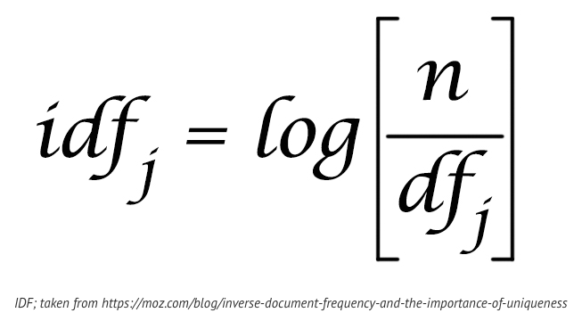

# snakesearch
a very small search engine

## Why would you build a small search engine in python?

Search engines are fundamental pieces of software. Fortunes have been built and lost with them.
They are also the kind of system that lets one understand the dynamics of key internet tech.
Analyzing these kinds of systems makes you think deeper about What and How these systems are built.

## What would you build a small search engine in python?

Google says a search engine has three phases: __Crawl, Index and Search__.

### Crawl

The first step to building a search engine is to have data to search. Depending on your use case you can crawl existing data (as Google does). What you mean crawl?

Build a program that 

- fetches the html of some web page
- put it all in a database 
- repeat

Oh, and while we're at it, let's make it so that we use some kind of concurrency (threads, multiple processes, or async/await). 

### Index

You build an index, an inverted index, from the stuff you collected during the crawl.'

An inverted index is a data structure that maps keywords to documents. This data structure makes it trivial to find documents where a certain word appears. When a user searches for some query the inverted index is used to retrieve all the documents that match with the keywords in the query.

### Search

Maybe a simple website that shows results of searching into the index we've built. 
You know, some HTML pages and a little bit of API

## How would you build a small search engine in python?

Say we want to modify a search engine and add the ability to use this idea?
We should start with a search engine and get it running and come back here.

Here is one now... [SnakeSearch](snakesearch/README.md)
It fetches a bunch of URLs of blog feeds (RSS), and indexes them.
How could we make it more general, by downloading general web pages?
An more specifically, what are the answers to these questions?

- What does the `engine/SearchEngine` do?
- What about `download_content.py`?
- Finally, where's all the data being kept?

Another way to look at the problem... [Building a full-text search engine in 150 lines of Python code](https://bart.degoe.de/building-a-full-text-search-engine-150-lines-of-code/)
This one doesn't have any UI associated with it.
But it does some interesting things with `wikipedia` data.

## What's important?

How do we decide what's important in these collections of documents?

well now... there is this Thing that get used to decide on the importance of documents.

what the hell is that?

turns out, very important. [Inverse Document Frequency and the Importance of Uniqueness](https://moz.com/blog/inverse-document-frequency-and-the-importance-of-uniqueness)

Also there is [BM25](https://en.wikipedia.org/wiki/Okapi_BM25). Is it used in either of our engine examples?

If you had thought of it first, you'd be the billionaire: There is [PageRank](https://en.wikipedia.org/wiki/PageRank); which made Google, well, Google.
